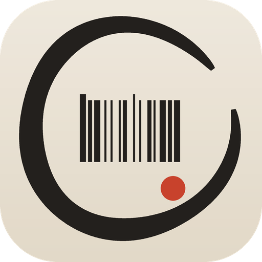
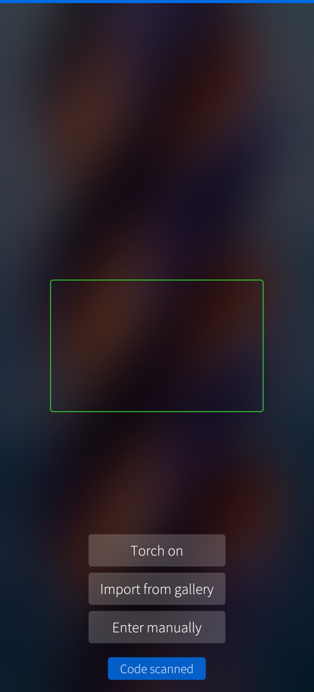
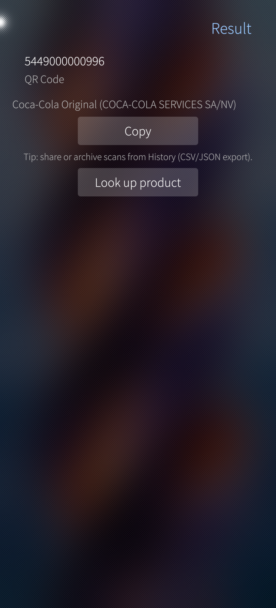
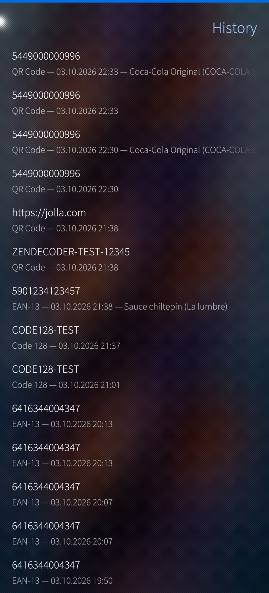
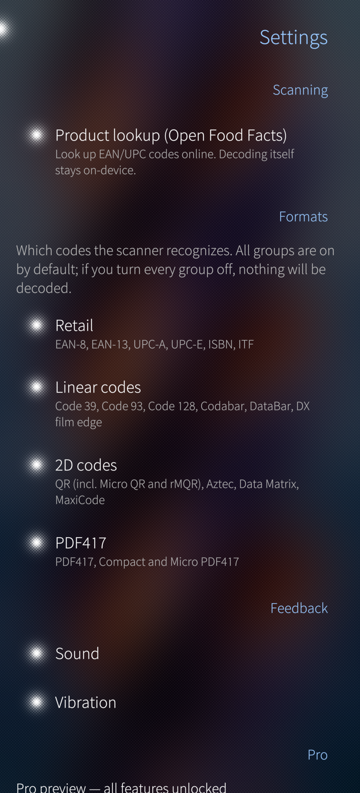

# ZenDecoder

**Barcode & QR scanner for Sailfish OS — on-device, private, all formats.**

<p align="center"></p>

ZenDecoder reads every code your camera, gallery or screenshots can show it:
retail barcodes, industrial 1D codes, 2D matrix codes and PDF417 — decoded
entirely on your device. No account, no ads, no tracking.

## Features

- **Live scanning** — QR (incl. Micro QR and rMQR), EAN-8, EAN-13, UPC-A/E,
  ISBN, ITF, Code 39/93/128, Codabar, DataBar, DX film edge, Aztec,
  Data Matrix, MaxiCode, PDF417
- **Import from gallery** — decode codes from screenshots and photos
- **History** — every scan kept with symbology and timestamp, exportable as
  CSV or JSON
- **Product lookup** — optional lookup of scanned EAN/UPC codes against
  [Open Food Facts](https://world.openfoodfacts.org) (the number is the only
  thing sent, and only when you enable it)
- **Your formats, your rules** — switch code groups on or off in Settings
- **Considered battery use** — the camera fully releases while the app is
  in the background

## Screenshots

| | |
|---|---|
|  |  |
|  |  |

## Building

qmake-based Sailfish OS project, built with [sfdk](https://sailfishos.github.io/sfdk/)
or the Sailfish IDE:

```sh
sfdk -c target=SailfishOS-5.1.0.11-aarch64 build
sfdk -c device= -c target=SailfishOS-5.1.0.11-aarch64 check -s harbour \
    RPMS/SailfishOS-5.1.0.11-aarch64/harbour-zendecoder-0.1.0-1.aarch64.rpm
```

The decoder is a vendored static build of [zxing-cpp](https://github.com/zxing-cpp/zxing-cpp)
v3.0.2 in `3rdparty/zxing-cpp/` (readers-only, no runtime dependencies).
A live-QR D-Bus fallback to the system `org.amberapi.zxing` daemon is built
in but only used when the static decoder declines.

## Privacy

All decoding happens on the device — frames never leave it. The only network
traffic is the optional product lookup, which sends the scanned numeric code
to Open Food Facts when enabled. See [PRIVACY.md](PRIVACY.md).

## License

`GPL-3.0-only AND Apache-2.0 AND BSD-3-Clause`

Application code is GPL-3.0-only; the vendored zxing-cpp is Apache-2.0 with
portions BSD-3-Clause. See [LICENSE](LICENSE) and
`3rdparty/zxing-cpp/LICENSE`.
